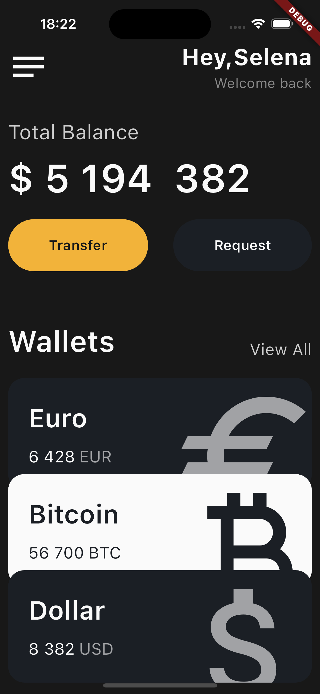

###

- iPhone 15_iOS 17.0

## Acknowledgement

UI/UX Design is originally from Kristina Taskaeva for Purrweb UI/UX Agency.
Here is the link from Dribble : [Dribble](https://dribbble.com/shots/19858341-Financial-Mobile-IOS-App)

# Flutter UI only clone Coding

- Wallet like Financial application
- Plaform: iOS / Android
- Language: Dart SDK version 3.2.3 (stable)
- Framework: Flutter 3.16.3 (stable)

## Overview

- Written in Dart
- Uses Flutter Framework
- UI Clone Coding (no function feature)

## Testing & Notes

- This is my first attempt to copy a design from Dribble. The goal was to explore Flutter and practice. And I got to say that I loved every moments of making it with the powerful harmony of Dart and Flutter.
